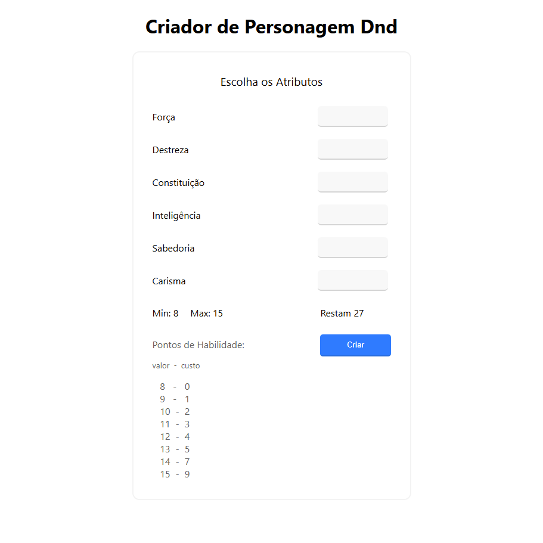
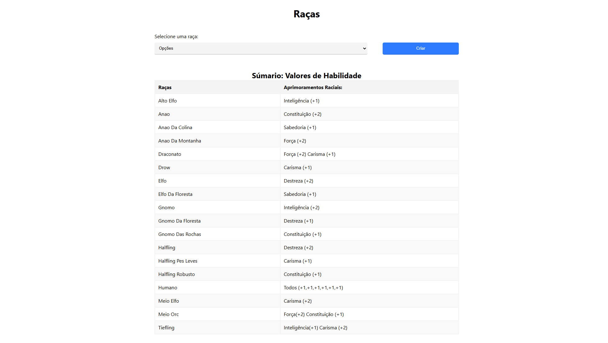
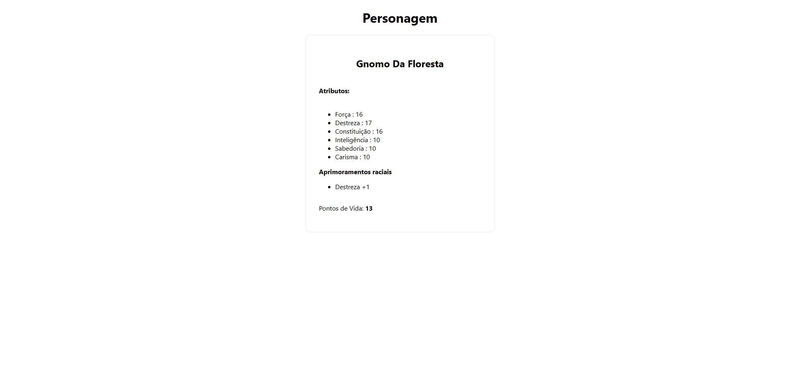

# Criador de Personagens Dungeons and Dragons

## Contexto

Projeto feito na Faculdade na matéria de Desenvolvimento Web 1. Utilizando programação orientada a objetos POO, utilizo arquitetura model, view, controller MVC. Utilizo requisições com método post, também mantenho o estado da aplicação com `$_SESSION` do PHP. 

<!--
> Utiliza a API []()
 -->

<!--
Colegas que contribuíram para a realização do projeto:

- [@colega1](https://github.com/ "github")
- [@colega2](https://github.com/ "github")
 -->

## Técnologias usadas
Front-end:
> Desenvolvido com: Html, Css, Javascript.

Back-end:
> Desenvolvido com: PHP, POO, MVC.

## Habilidades

Adquiri as seguintes habilidades ao desenvolver esse projeto:

- O conhecimento dos pilares da Programação Orientada a Objetos: Herança, Encapsulamento e Polimorfismo.

- Criar e utilizar Interface;

- Implementar, Classes, Instâncias, Atributos, Métodos e Objetos;

## Preview da Aplicação

|  |
| :---: |
|  |
|  |

## Instalando Dependências

- clone o projeto:

  ```bash
    git@github.com:Andreyrvs/Criador-personagens-Dnd.git
  ```

## Executando aplicação

- Para rodar o Back-end abre o terminal na pasta raiz:

  ```bash
    $ php -S localhost:8000
  ```
